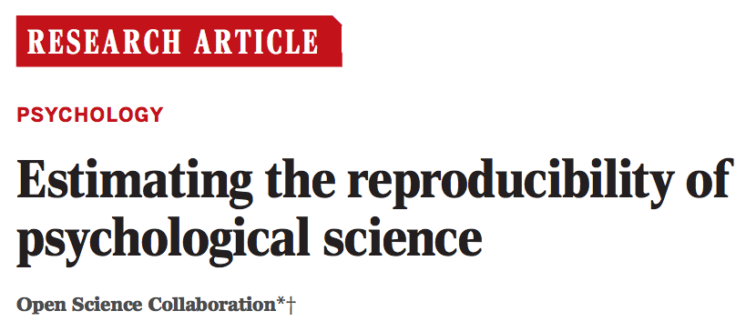
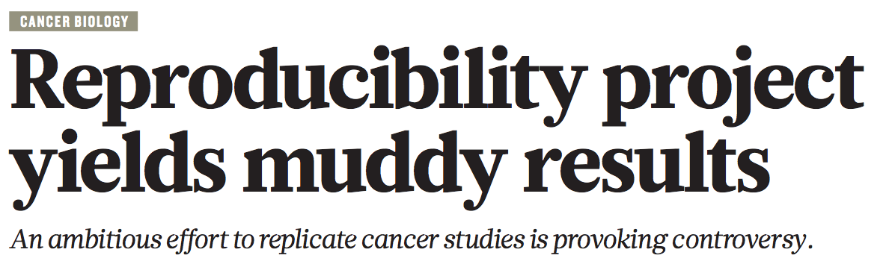

## Reproducibility versus replication

* Replication
    * Same conclusion from same approach and **different data**
    * Generating new data is costly
    * Little incentive due to pressure to publish novel results
* Reproducibility
    * Same conclusion from same approach and **same data**

## Reproducibility 

> An attainable minimum standard for assessing the value of scientific claims.
>
> -- Sandve _et al._, 2013

## Reproducibility crisis

 

## Reproducibility crisis -- Exercise 

* Could I replicate Figure 1 from your last publication? 
    * Is the data available?
    * Is the code available?
    * Did you include details on which software you used?
    * Which software versions?

## Why are we facing this crisis?

* Reproducibility isn't taught in school
* The incentives in science run counter to spending time on this
* **This is changing:** Funding agencies are catching on to the problem
* They are starting to require:
    * Open data (_e.g._ data management plans)
    * Open access
    * Open methods next?

## What enables reproducibility?

* What do I need to re-do your experiment?
* **Every. Single. Detail.**
    * Data needs to be shared
    * Methods needs to be detailed and comprehensive
* Scientific computing has an advantage
    * Computers are very good at following instructions

## Why should I care?

* Moral responsibility as scientists (blah, blah, blah...)
* It makes your life easier as a researcher
* You often have to revisit past analyses
    * New data
    * Realizing a mistake
    * Improvements to the methodology

## Your primary collaborator

> Your primary collaborator is yourself 6 months from now, and your past self 
> doesn’t answer emails.

## Today's Project

* Dataset
    * 303 patients show up at clinic with chest pain
    * Clinical data for 13 variables
        * Age, sex, calcium levels, etc.
    * Outcome: Whether the patient has heart disease
* Objective
    * Predict whether a patient has heart disease using the clinical data