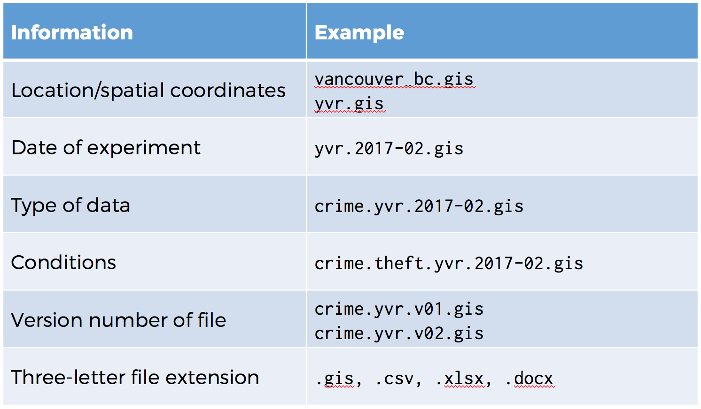

## The Why?

* There is a **huge** difference between navigating an organized project 
  and a disorganized one
* Data analyses are becoming more complex
    * Different data types
    * External datasets
    * Multiple analyses in different scripts

## The How?

* Everything in one folder
    * Helps with _Principle #3_
* There are many possible project structures
    * **Most important:** Be consistent
    * Create a `README` file with a description of your project structure
    * Every file should have a single logical location

## The README

* Context of data collection (goals, hypotheses)
* Data collection methods 
* Structure of files
* Sources used
* Quality assurance (data validation, checking)
* Data modifications
* Confidentiality and permissions
* Names of labels and variables
* Explanations of codes and classifications

## File naming

## ISO-8601

 

## Example

 

~~~
|-- data
|  |-- yvr.2016-06-13.birds_count.csv
|  |-- yvr.2016-07-27.birds_count.csv
|  `-- yul.2016-06-13.birds_count.csv
|
|-- docs  # Notes and manuscript
|  |-- notebook.md
|  |-- manuscript.md
|  `-- changelog.txt
|
|-- results  # Output (disposable)
|  `-- summarized_results.csv
|
`-- src  # Scripts
   |-- sightings_analysis.R
   `-- runall.R
~~~
{: .source}

> ## Practice
> 
> * Create project directory: `predict_hd`
> * Create sub-directories
>     * `bin`, `data`, `docs`, `results`, `src`
> * Create a simple README
> * Alternative: [`ProjectTemplate`](http://projecttemplate.net/getting_started.html) 
>   package
{: .challenge}

