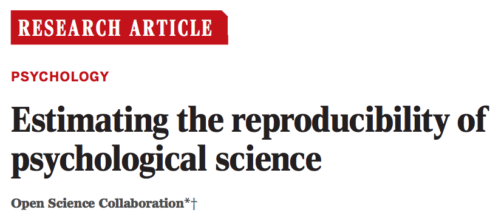
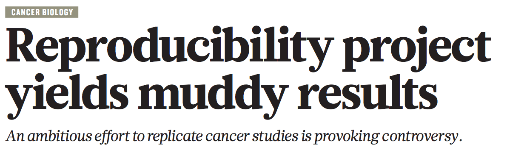
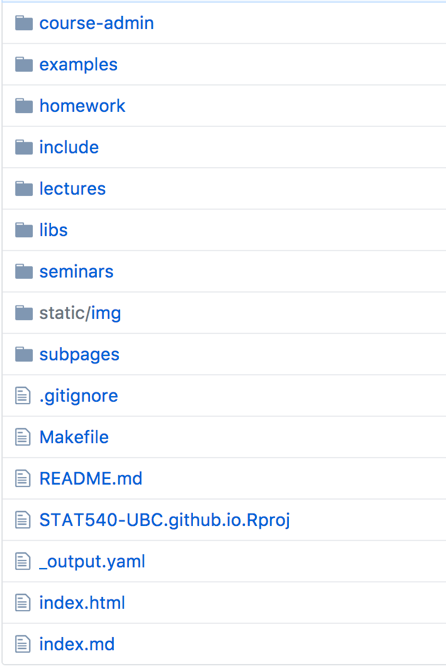
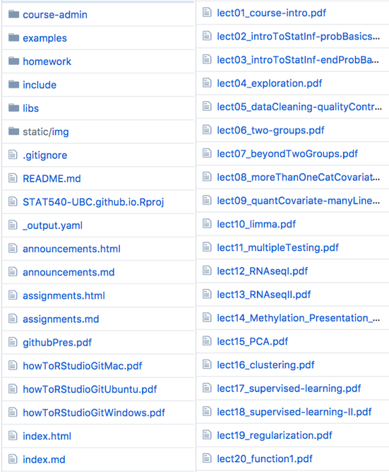
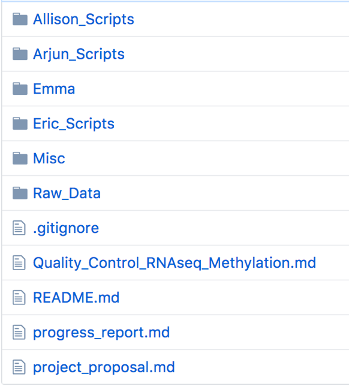
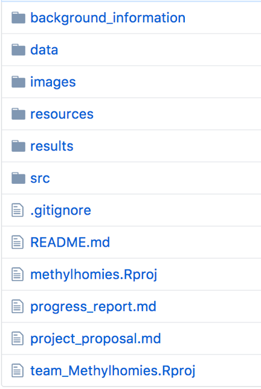
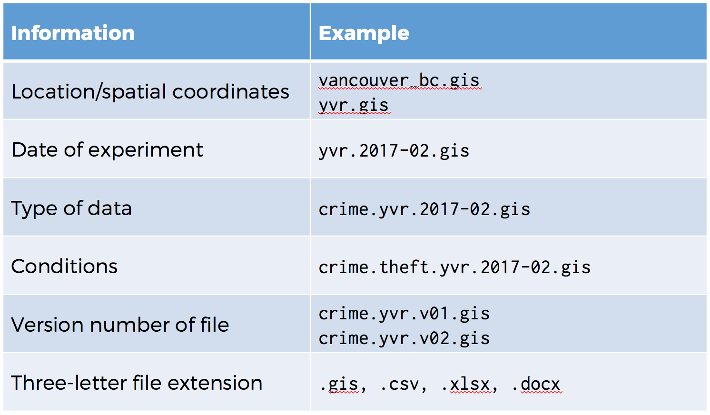
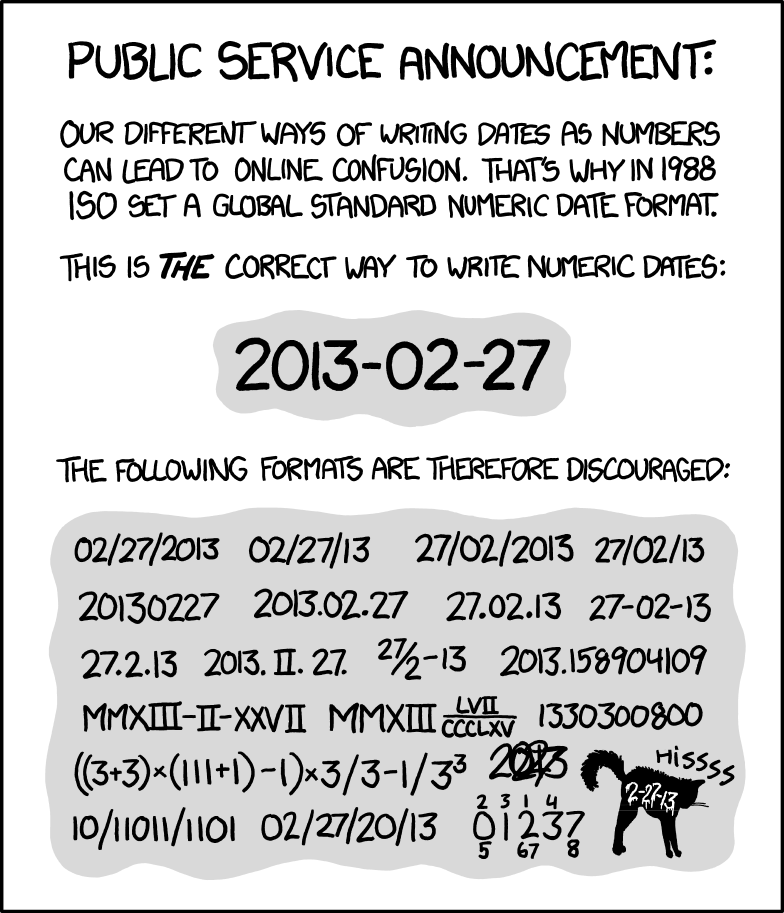

# Installation Instructions

* Install R if you don't already have it
* **Optional:** Install Git (or _Git for Windows_)
* Install the following R packages using `install.packages()`
    * `tidyverse`
    * `rmarkdown`
    * `randomForest`


# What Is Reproducibility?

## Reproducibility versus replication

* Replicating a result
    * Using same approach but **different data**
    * Ideal, but generating new data is costly
    * Journals prefer novel findings
* Reproducing a result
    * Using same approach and **same data**

## Reproducibility

> An attainable minimum standard for assessing the value of scientific claims.
>
> -- Sandve _et al._, 2013

## Reproducibility crisis




## Reproducibility exercise

* Could I replicate Figure 1 from your last publication using only what is available online?
    * **Minimum:** Is the data available?
    * **Better:** Is the code available?
    * **Best:** Did you detail which software was used, including versions?

> As computational researcher, we can rely on the fact that 
> computers are very good at following instructions.

## Why are we facing this crisis?

* Reproducibility isn't taught to researchers
* Little incentive to spend time on this due to publish or perish model
* **This is changing:** Funding agencies are catching on to the problem
* They are starting to require:
    * Open data (_e.g._ data management plans)
    * Open access publications
    * Is open-source code the next requirement? 

## Why should I care?

* Moral responsibility as scientists <span style="color:#bbb;">(bla, bla, bla...)</span>
* It makes your life easier as a researcher
* You often have to revisit past analyses
    * Realizing a mistake
    * New or updated data and/or methods

> Your primary collaborator is yourself 6 months from now, and your past self
> doesn’t answer emails.


# Today's project

* Dataset
    * 303 patients show up at clinic with chest pain
    * Clinical data for 13 variables
        * Age, sex, calcium levels, etc.
    * Outcome: Whether the patient has atherosclerotic heart disease (AHD)
* Objective
    * Predict whether a patient has heart disease using the clinical data


#  Principle #1: Organize your files

## Why should you organize your files?

* There is a **huge** difference between navigating an organized project
  and a disorganized one
* Data analyses are becoming more complex
    * Different data types
    * External datasets
    * Multiple analyses in different scripts

## How can you organize your files?

* Everything in one folder
    * Helps with _Principle #2_
* There are many possible project structures
    * **Most important:** Be consistent
    * Create a `README` file with a description of your project structure
    * Every file should have a single logical location

## Using sub-folders effectively

<section>


</section>

## Naming sub-folders

<section>


</section>

## Note to self: The README file

* Context of data collection (goals, hypotheses)
* Data collection methods
* Structure of files
* Sources used
* Quality assurance (data validation, checking)
* Data modifications
* Confidentiality and permissions
* Names of labels and variables
* Explanations of codes and classifications

## Naming data files



## ISO-8601: The date format to rule them all



## Tying everything together
 
```
|-- data
|  |-- yvr.2016-06-13.bird_counts.csv
|  |-- yvr.2016-07-27.bird_counts.csv
|  `-- yul.2016-06-13.bird_counts.csv
|
|-- docs  # Notes and manuscript
|  |-- notebook.md
|  |-- manuscript.md
|  `-- changelog.txt
|
|-- results  # Output (disposable)
|  `-- summarized_results.csv
|
`-- scripts  # Code
   |-- sightings_analysis.R
   `-- runall.R
```

## Hands-on practice

**Organize your files**

* Create project directory: `predict_hd`
* Create sub-directories
    * `data`, `docs`, `results`, `scripts`
* Create a simple README
* Alternative: [`ProjectTemplate`](http://projecttemplate.net/getting_started.html) package


# Principle #2: Be portable

## Why should the project be portable?

* You shouldn't assume your code will only be run on your computer
* You can't collaborate otherwise
    * With others
    * With yourself (_e.g._ home and work computers)

## How can a project be made portable?

* **Again:** Everything in one folder
* Parameterize any file paths
* Use relative paths instead
* Small files can be tracked using version control

## Hands-on practice

**Be portable**

* Use `setwd()` (not portable)
* Create R Project, close RStudio, open the project and run `getwd()`
* **Even better:** The `here` R package


# Principle #3: Track your project history

## Why should you track your project history?

* Small changes can have big—often unintended—consequences
* You can revert to a version that generated a specific result
* If you use GitHub, it can act as a back-up
* Simplifies collaboration
    * With others
    * With yourself on different computers

## Which tools can track your project history?

* Version control systems
    * Git, Subversion, Mercurial
* Git is popular because of GitHub
* Git integrates nicely with RStudio
* Alternatively, you can maintain copies of your scripts

## How can you track your project history?

* **Rule of thumb:** Track any file created by a human as soon as
  they're created
* Works best with plain text files
* You can also track your data if it's not too big
* But you shouldn't track results
    * Ideally, you can regenerate all of your results from scratch
      (_Principle #5_)

## Hands-on practice

**Track your project history**

* Initialize Git repository in RStudio Project
* Add files (_e.g._ `README`) to Git repository
* Download data, add to `data` folder and commit
    * http://bit.ly/rrr-data
* For more info: http://happygitwithr.com/

## When should you commit to Git?

* Small changes
* Related in some way ("atomic")
* There's no specific time interval
    * Whatever time it takes to complete one task
* Sync with GitHub regularly (_e.g._ at the end of each day)


# Principle #4: Treat data as read-only

## Why shouldn't you edit your data manually?

* Error-prone
* Inefficient
* Difficult to reproduce
* Irreversible
    * Hopefully you have backups of your data

## How can you treat data as read-only?

* Leave the data as it was given to you
    * From an instrument, a survey, a collaborator, etc.
* Separate raw data from cleaned-up data
* Configure raw data as read-only
* Avoid manual changes
  * Ideally, automate changes with a script
  * Otherwise, make a copy and note what changes you made and why
* Store data in an open, non-proprietary file format

## Example

```
|-- README
|-- data
|  |
|  |-- raw_data
|  |   ` birds_count_table.csv  # Never edited!
|  |
|  `-- clean_data
|      ` birds_count_table.clean.csv
|
|-- src
|  ` clean_data.R  # Script instead of manual editing
|
[...]
```

## Hands-on practice

**Treat data as read-only**

* Split `data` folder into `data/raw_data` and `data/clean_data`
* Move raw data (`Heart.csv`) into `data/raw_data`
* Set files as read-only
  * In R: `Sys.chmod("data/raw_data/Heart.csv", "555")`
* Attempt to edit the `Heart.csv` raw data file
* Write R script to fix dataset
    * Inconsistent capitalization
* Ignore `clean_data` folder in `.gitignore`
* Update Git repository


# Principle #5: Store code in scripts

## Why should you store code in scripts?

* Any code or command you run is necessary for reproducing your results
* You will likely have to re-run parts of your analysis
    * Realizing a mistake
    * New or updated data and/or methods
* Relying on your command history (or memory) is very risky

## What code should you store in scripts?

* Yes, **all** code that you run at least once should be stored in a script
* Even "throwaway" code that will "probably never be used again"
* Ideally, you should be able to regenerate all of your results from scratch
    * Using just your scripts and no manual commands

## How can you store code in scripts?

* You can still use an interactive console
    * Just be diligent to save the commands afterwards
* Scripts should be under version control
* Manual interventions, if unavoidable, should be tracked
* **Bonus:** Follow a consistent coding style

## Hands-on practice

**Store code in scripts**

* Copy commands for cleaning data to `analysis.R`
* Expand `analysis.R`
    * Train random forest model
    * Save fit and plot results
* Adopt a consistent coding style= -
    * [Hadley Wickam's style guide](http://adv-r.had.co.nz/Style.html)


# Principle #6: Document code and results

## Why should you document code and results?

* Scripting is the documentation of what you did
* But why did you do code something one way versus another?
* And how do you interpret the results?
* What if there was a way of achieving all of the above in one fell swoop?

## Documenting your code with comments

* Code comments are a common approach
* Start every script with a brief comment explaining:
    * What it does
    * Usage information
    * An example (worth a thousand words)
    * Reasonable parameters values

## Level up: Literate programming

* Code and textual annotations are intertwined
* You explain with text what you're doing in code and more importantly,
  why you are doing it
* You also interpret results (_e.g._ figures) as they're generated
* One method: R Markdown

## What is R Markdown?

[Quick Demo Video](http://rmarkdown.rstudio.com/lesson-1.html)

## Hands-on practice

**Document code and results**

* Introduce Markdown (see cheat sheet)
* Convert `analysis.R` to `analysis.Rmd`
* Look over some common R Markdown options (see cheat sheet)
    * `warnings=FALSE, messages=FALSE`
* Output document to Word


# Principle #7: Track software versions

## Why should you track software versions?

* Software versions are important
    * Inputs and outputs can change
    * Software behaviour can change
    * **End result:** Potentially very different results
* Very difficult to figure out when trying to reproduce a result
    * Even when everything else was done properly

## Case in point

Run the following code in your R console:

```r
library(dplyr)

by_species <- group_by(iris, Species)

by_sepal_width  <- arrange(by_species, Sepal.Width)

# Shortest petal length among setosa flowers
by_sepal_width[[1, "Petal.Length"]]
```
> - Major dplyr change after version 0.4.3

## How can youn track software versions?

* If you use little software:
    * Manually keep track of software versions
* If you use a lot of software:
    * Use package managers like Conda/Bioconda
    * In R, print the session info at the end of each analysis

## Hands-on practice

**Track software versions**

* Add `sessionInfo()` at the end of the R Markdown file
    * Alternatively, you can use `sessioninfo::session_info()`
* Introduce the Conda package manager and the Bioconda recipes
    * Generate a `requirements.txt` file
    * Create a new environment from that `requirements.txt` file
    * I do **not** recommend using Conda for R


# Principle #8: Modularize your analyses

## Why should you modularize your analyses?

* Easier to re-run parts of the analysis
    * Especially useful when some parts are computationally intensive
* Easier to understand, share, describe and modify the code
* Naturally leads to the creation of useful intermediate files

## How can you modularize your analyses?

* Split scripts into multiple components that tie into one another
* Use intermediate files as connections between scripts
* Use standard formats instead of binary/proprietary formats
    * For example, CSV is better than RDS/RData
* If you need speed, export a plain text version and a binary version

## Hands-on practice

**Modularize your analyses**

* Split `analysis.Rmd` into `01-tidy.Rmd`, `02-train.Rmd` and `03-plot.Rmd`
    * Don't forget to output intermediate files
* Demo R Markdown website
    * Create `index.Rmd` and `_site.yml` files
    * Run `rmarkdown::render_site("src")`


# Principle #9: Be deterministic

## Why should you be deterministic?

* RNG = Random number generator
* A result that relies on a RNG will inevitably be impossible to be
  perfectly reproduced
* **Unless:** A seed is set, which allows the RNG to be deterministic
* Perfect for reproducibility!

## How can you be deterministic?

* Generate a random number that can act as the seed
* Set the RNG seed to that random number

## Hands-on practice

**Be deterministic**

* Compare error rates among learners
    * They should be different
* Generate a random number using `runif(1, 0, 1e8)`
* Set seed at the top of each script that uses a RNG
    * Here, only `train.Rmd` relies on a RNG
    * Use the `set.seed()` function
* Compare error rates again
    * They should be the same now


# Principle #10: Share openly and freely!

## Why should you share openly and freely?

[Why Open Research?](whyopenresearch.org)

* Increase your visibility
* Reduce publishing costs
* Take back control
* Get more funding
* Publish where you want
* Get that promotion

## How can you share more openly and freely?

* Share data, code and results
* Use reputable repositories that can mint DOIs
    * Figshare, Dryad, Zenodo
* Include any metadata expected by your research community
* Include a [CITATION file](https://github.com/dib-lab/khmer/blob/master/CITATION)
* Include a [LICENSE file](https://github.com/dib-lab/khmer/blob/master/LICENSE)

## Where can you openly and freely share your data?

It depends on what form the data is in

* If it's small, it can be included in your repository
* Institutional repository (_e.g._ SFU RADAR)
* Reputable repositories (_e.g._ Figshare, Dryad, Zenodo)
* Domain-specific repository (_e.g._ NCBI SRA for sequencing data)

## Hands-on practice

**Share openly and freely**

* Sharing code is as easy as switching the GitHub repository to public
    * You can create a tag in Git to mark the version that was used
* Share results in open-access publications
    * You can also post preprints
    * Journals policies can be found on [SHERPA/RoMEO](http://www.sherpa.ac.uk/romeo/index.php)


# The End

## Thank you for your attention!

<span style="font-size:3em;">✌🏻</span>

The `Heart-csv` dataset used in this presentation was taken from "An Introduction to Statistical Learning, with applications in R"  (Springer, 2013) with permission from the authors: G. James, D. Witten,  T. Hastie and R. Tibshirani.


# Extra Stuff

## R code for lesson

```r
# Tidy ---------------------------------------------------

library(here)
library(tidyr)

heart_raw_file <- here("data/raw_data/Heart.csv")
heart_raw <- read.csv(heart_raw_file)

heart_clean <- drop_na(heart_raw)

heart_clean_file <- here("data/clean_data/Heart.csv")
write.csv(heart_clean, heart_clean_file)

sessionInfo()


# Train --------------------------------------------------

library(here)
library(randomForest)

heart_clean_file <- here("data/clean_data/Heart.csv")
heart_clean <- read.csv(heart_clean_file)

rf_model <- randomForest(AHD ~ ., heart_clean, 
                         importance = TRUE, 
                         keep.forest = TRUE)

rf_model_file <- here("results/random_forest_model.rds")
saveRDS(rf_model, rf_model_file)

sessionInfo()


# Plot ---------------------------------------------------

library(randomForest)

rf_model_file <- here("results/random_forest_fit.rds")
rf_model <- readRDS(rf_model_file)

heart_clean_file <- here("data/clean_data/Heart.csv")
heart_clean <- read.csv(heart_clean_file)

print(rf_model)

plot(rf_model)

varImpPlot(rf_model)

partialPlot(rf_model, heart_clean, "Ca")

sessionInfo()
```
