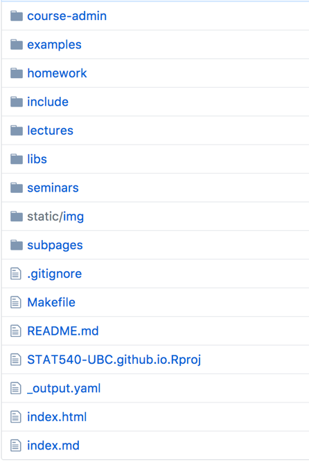
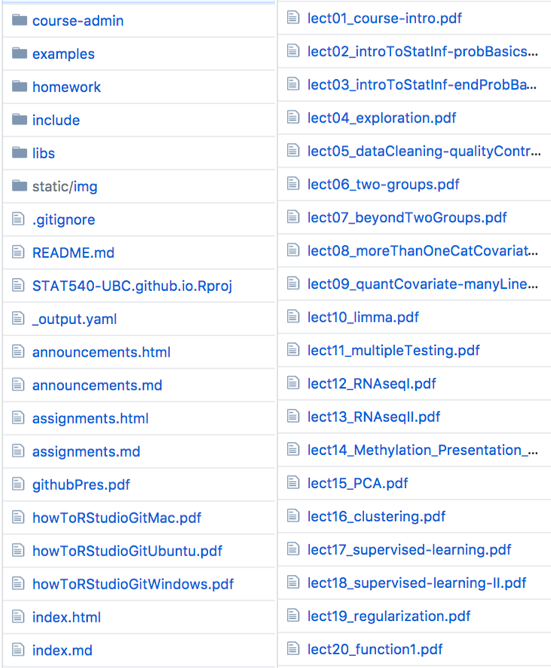
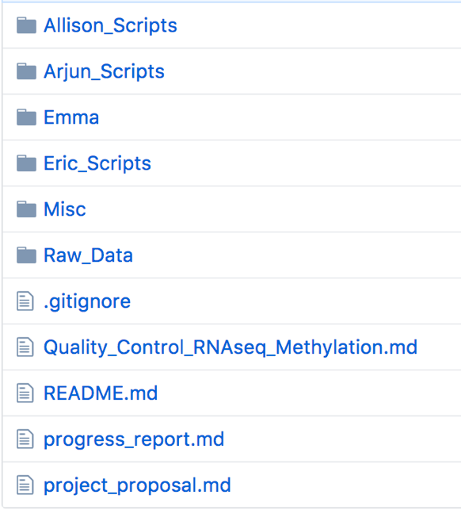
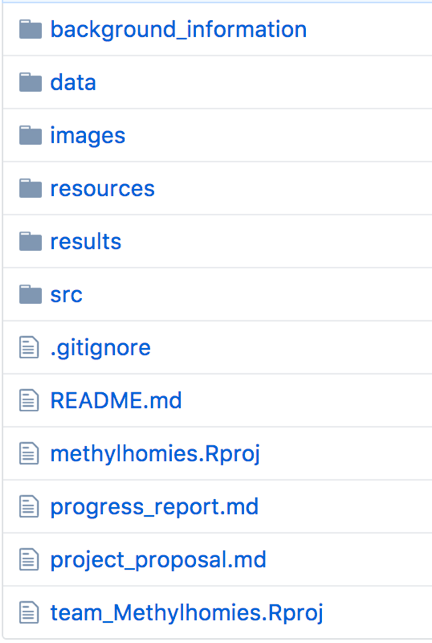

# What would you like to learn in this workshop? {.center}


# What Is Reproducibility? {.center}

## Reproducibility versus replication

* Replication
    * Same conclusion from same approach and **different data**
    * Generating new data is costly
    * Little incentive due to pressure to publish novel results
* Reproducibility
    * Same conclusion from same approach and **same data**

## Reproducibility {.center}

<br/>

> An attainable minimum standard for assessing the value of scientific claims.
>
> -- Sandve _et al._, 2013

## Reproducibility crisis

<br/>


## Reproducibility crisis -- Exercise {.center}

* Could I replicate Figure 1 from your last publication? 
    * Is the data available?
    * Is the code available?
    * Did you include details on which software you used?
    * Which software versions?

## Why are we facing this crisis?

* Reproducibility isn't taught in school
* The incentives in science run counter to spending time on this
* **This is changing:** Funding agencies are catching on to the problem
* They are starting to require:
    * Open data (_e.g._ data management plans)
    * Open access
    * Open methods next?

## What enables reproducibility?

* What do I need to re-do your experiment?
* **Every. Single. Detail.**
    * Data needs to be shared
    * Methods needs to be detailed and comprehensive
* Scientific computing has an advantage
    * Computers are very good at following instructions

## Why should I care?

* Moral responsibility as scientists <span style="color:#bbb;">(blah, blah, blah...)</span>
* It makes your life easier as a researcher
* You often have to revisit past analyses
    * New data
    * Realizing a mistake
    * Improvements to the methodology
  
## {.center}

> Your primary collaborator is yourself 6 months from now, and your past self 
> doesn’t answer emails.


# Ten Principles for Reproducibility {.center}

## Today's Project

* Dataset
    * 303 patients show up at clinic with chest pain
    * Clinical data for 13 variables
        * Age, sex, calcium levels, etc.
    * Outcome: Whether the patient has heart disease
* Objective
    * Predict whether a patient has heart disease using the clinical data


#  Principle #1: <br/>Organize your files {.center}

## P1: Organize your files -- The Why?

* There is a **huge** difference between navigating an organized project 
  and a disorganized one
* Data analyses are becoming more complex
    * Different data types
    * External datasets
    * Multiple analyses in different scripts

## P1: Organize your files -- The How?

* Everything in one folder
    * Helps with _Principle #3_
* There are many possible project structures
    * **Most important:** Be consistent
    * Create a `README` file with a description of your project structure
    * Every file should have a single logical location

## P1: Organize your files -- Sub-directories

<br/>
<section>


</section>

## P1: Organize your files -- Sub-directories

<br/>
<section>


</section>

## P1: Organize your files -- The README

* Context of data collection (goals, hypotheses)
* Data collection methods 
* Structure of files
* Sources used
* Quality assurance (data validation, checking)
* Data modifications
* Confidentiality and permissions
* Names of labels and variables
* Explanations of codes and classifications

## P1: Organize your files -- File naming

<br/>


## P1: Organize your files -- ISO-8601

<br/>

 
## P1: Organize your files -- Example

<br/>

```
|-- data
|  |-- yvr.2016-06-13.birds_count.csv
|  |-- yvr.2016-07-27.birds_count.csv
|  `-- yul.2016-06-13.birds_count.csv
|
|-- docs  # Notes and manuscript
|  |-- notebook.md
|  |-- manuscript.md
|  `-- changelog.txt
|
|-- results  # Output (disposable)
|  `-- summarized_results.csv
|
`-- src  # Scripts
   |-- sightings_analysis.R
   `-- runall.R
```

## Organize your files -- Practice {.center}

## Organize your files -- Practice

* Create project directory: `predict_hd`
* Create sub-directories
    * `bin`, `data`, `docs`, `results`, `src`
* Create a simple README
* Alternative: [`ProjectTemplate`](http://projecttemplate.net/getting_started.html) 
  package


# Principle #2: <br/>Track your project history {.center}

## P2: Track your project history -- The Why?

* Small changes can have big consequences
    * Some can be unintended
* You can revert to a version that generated a specific result
* If you use GitHub, it can act as a back-up
* Simplifies collaboration 
    * With others 
    * With yourself on different computers

## P2: Track your project history -- The What?

* Version control systems
    * Git, Subversion, Mercurial
* Git is popular because of GitHub
* Git integrates nicely with RStudio
* Alternatively, you can maintain copies of your scripts
   
## P2: Track your project history -- The How?

* **Rule of thumb:** Track any file created by a human as soon as 
  they're created
* Works best with plain text files
* You can also track your data if it's not too big
* But you shouldn't track results
    * Ideally, you can regenerate all of your results from scratch 
      (_Principle #5_)
    

## P2: Track your project history -- Practice {.center}
   
## P2: Track your project history -- Practice

* Initialize Git repository locally
* Add files (_e.g._ README) to git (`git add`, `git commit`)
* Download data, add to `data` folder and commit
    * `http://www-bcf.usc.edu/~gareth/ISL/Heart.csv`
* Create repository on GitHub: `predict_hd`
* Configure GitHub on local repo and `git push origin master`
* Explore GitHub's user interface

## P2: Track your project history -- The When?

* When do I commit to Git?
    * Small changes
    * Related in some way ("atomic")
    * There's no specific time interval
        * Whatever time it takes to complete one task
    * Sync with GitHub regularly


# Principle #3: <br/>Be portable {.center}

## P3: Be portable -- The Why?

* You shouldn't assume your code will only be run on your computer
* You can't collaborate otherwise

## P3: Be portable -- The How?

* **Again:** Everything in one folder
* Parameterize any file paths
* Use relative paths instead
* Small files can be tracked using version control

## P3: Be portable -- Practice {.center}

## P3: Be portable -- Practice

* Attempt to load data after opening RStudio
* Use `setwd()` (not portable)
* Create R Project, close RStudio, open the project and run `getwd()`
* Alternative: `rprojroot` package
* Update Git repository


# Principle #4: <br/>Treat data as read-only {.center}

## P4: Treat data as read-only -- The Why?

* Error-prone
* Inefficient 
* Difficult to reproduce
* Potentially irreversible
    * Hopefully you have backups of your data

## P4: Treat data as read-only -- The How?

* Leave the data as it was given to you 
    * From an instrument, a survey, etc.
* Separate raw data from cleaned-up data
* Configure raw data as read-only 

## P4: Treat data as read-only -- The How?

* Avoid manual changes
* Instead, automate changes with a script
* If that's not possible, make a note of:
    * What the manual change was
    * Why it was needed
* Store data in an open, non-proprietary file format

## P4: Treat data as read-only -- Example

<br/>

```
|-- README
|-- data
|  |
|  |-- raw_data
|  |   ` birds_count_table.csv  # Never edited!
|  |
|  `-- clean_data
|      ` birds_count_table.clean.csv
|
|-- src
|  ` clean_data.R  # Script instead of manual editing
| 
[...]
```

## P4: Treat data as read-only -- Practice {.center}

## P4: Treat data as read-only -- Practice

* Split `data` folder into `data/raw_data` and `data/clean_data`
* Move raw data (`Heart.csv`) into `data/raw_data`
* Use `chmod -R 555 data/raw_data` to set files as read-only
* Attempt to delete or edit a raw data file
* Use R console to fix `Heart.csv` and output cleaned-up version
* Ignore cleaned-up data in `.gitignore`
* Update Git repository


# Principle #5: <br/>Store code in scripts {.center}

## P5: Store code in scripts -- The Why?

* Any code or command you run is necessary for reproducing your results
* You will likely have to re-run parts of your analysis
    * New data
    * Realizing a mistake
    * Improvements to the methodology
* Relying on your command history is very risky

## P5: Store code in scripts -- The What?

* Yes, **all** code that you run at least once should be stored in a script
* Even "throwaway" code that will "probably never be used again"
    * Keep telling yourself that, it's cute.
* Ideally, you should be able to regenerate all of your results from scratch
    * Using just your scripts and no manual commands

## P5: Store code in scripts -- The How?

* You can still use an interactive console
    * Just be diligent to save the commands afterwards
* Scripts should be under version control
* Manuel interventions, if unavoidable, should be tracked
* **Bonus:** Follow a consistent coding style

## P5: Store code in scripts -- Practice {.center}

## P5: Store code in scripts -- Practice

* Copy commands for cleaning data to `analysis.R`
* Expand `analysis.R`
    * Split data into train and test cohorts
    * Train random forest model
    * Save fit and plot results
* Adopt a consistent coding style
    * [Google's R Style Guide](https://google.github.io/styleguide/Rguide.xml)
    * [Hadley Wickam's Style Guide](http://adv-r.had.co.nz/Style.html)


# Principle #6: <br/>Document code and results {.center}

## P6: Document code and results -- The What?

* Scripting is the documentation of what you did
* But why did you do code something one way versus another? 
* And how do you interpret the results? 
* What if there was a way of achieving all of the above in one fell swoop?

## P6: Document code and results -- The How?

* Code comments are a common approach
* Start every script with a brief comment explaining:
    * What it does
    * Usage information
    * An example (worth a thousand words)
    * Reasonable parameters values

## P6: Document code and results -- The How?

* **The next level:** Literate programming
    * Code and textual annotations are intertwined
    * You explain with text what you're doing in code and more importantly,
      why you are doing it
    * You also interpret results (_e.g._ figures) as they're generated

## P6: Document code and results -- R Markdown

<br/><br/>

[Quick Demo Video](http://rmarkdown.rstudio.com/lesson-1.html)

## P6: Document code and results -- Practice {.center}

## P6: Document code and results -- Practice

* Introduce Markdown (see cheat sheet)
* Convert `analysis.R` to `analysis.Rmd`
* Look over some common R Markdown options (see cheat sheet)
    * `warnings=FALSE, messages=FALSE`
* Output document to Word


# Principle #7: <br/>Track software versions {.center}

## P7: Track software versions -- The Why?

* Software versions are important
    * Inputs and outputs can change
    * Software behaviour can change
    * **End result:** Potentially very different results
* Very difficult to figure out when trying to reproduce a result
    * Even when everything else was done properly

## P7: Track software versions -- Exercise {.center}

```r
library(dplyr)

by_species <- group_by(iris, Species)

by_sepal_width  <- arrange(by_species, Sepal.Width)

# Shortest petal length among setosa flowers
by_sepal_width[[1, "Petal.Length"]]
```

## P7: Track software versions -- The How?

* If you use little software:
    * Manually keep track of software versions
* If you use a lot of software:
    * Use package managers like Conda/Bioconda
    * In R, print the session info at the end of each analysis

## P7: Track software versions -- Practice {.center}

## P7: Track software versions -- Practice

* Add `sessionInfo()` at the end of the R Markdown file
    * Alternatively, you can use `devtools::session_info()`
* Introduce the Conda package manager and the Bioconda recipes
    * Demo installing a specific version of R (v3.2.1)
    * Generate a `requirements.txt` file
    * Create a new environment from that `requirements.txt` file


# Principle #8: <br/>Modularize your analyses {.center}

## P8: Modularize your analyses -- The Why?

* Easier to re-run parts of the analysis
    * Especially useful when some parts are computationally intensive
* Easier to understand, share, describe and modify the code
* Naturally leads to the creation of useful intermediate files

## P8: Modularize your analyses -- The How?

* Split scripts into multiple components that tie into one another
* Use intermediate files as connections between scripts
* Use standard formats instead of binary/proprietary formats
    * For example, CSV is better than RDA/RData
* If you need speed, export a plain text version and a binary version

## P8: Modularize your analyses -- Practice {.center}

## P8: Modularize your analyses -- Practice

* Split `analysis.Rmd` into `01-tidy.Rmd`, `02-train.Rmd` and `03-plot.Rmd`
    * Don't forget to output intermediate files
* Demo R Markdown website
    * Create `index.Rmd` and `_site.yml` files
    * Run `rmarkdown::render_site("src")`


# Principle #9: <br/>Be deterministic {.center}

## P9: Be deterministic -- The Why?

* RNG = Random number generator
* A result that relies on a RNG will inevitably be impossible to be 
  perfectly reproduced
* **Unless:** A seed is set, which allows the RNG to be deterministic
* Perfect for reproducibility! 

## P9: Be deterministic -- The How?

* Generate a random number that can act as the seed
* Set the RNG seed to that random number

## P9: Be deterministic -- Practice {.center}

## P9: Be deterministic -- Practice

* Compare error rates among learners
    * They should be different
* Generate a random number using `runif(1, 0, 1e8)`
* Set seed at the top of each script that uses a RNG
    * Here, only `train.Rmd` relies on a RNG
    * Use the `set.seed()` function
* Compare error rates again
    * They should be the same now


# Principle #10: <br/>Share openly and freely! {.center}

## P10: Share openly and freely -- The Why?

<br/><br/><br/><br/>
[Why Open Research?](whyopenresearch.org)

## P10: Share openly and freely -- The Why?

* Increase your visibility
* Reduce publishing costs
* Take back control
* Get more funding
* Publish where you want
* Get that promotion

## P10: Share openly and freely -- The How?

* Share data, code and results
* Use reputable repositories that can mint DOIs
    * Figshare, Dryad, Zenodo
* Include any metadata expected by your research community
* Include a [CITATION file](https://github.com/dib-lab/khmer/blob/master/CITATION)
* Include a [LICENSE file](https://github.com/dib-lab/khmer/blob/master/LICENSE)

## P10: Share openly and freely -- Practice {.center}

## P10: Share openly and freely -- Practice

* Where to share data depends on the data itself
    * If it's small, it can be included in your repository
    * Institutional repository (_e.g._ SFU RADAR)
    * Reputable repositories (_e.g._ Figshare, Dryad, Zenodo)
    * Domain-specific repository (_e.g._ NCBI SRA for sequencing data)

## P10: Share openly and freely -- Practice

* Sharing code is as easy as switching the GitHub repository to public
    * You can create a tag in Git to mark the version that was used
* Share results in open-access publications
    * You can also post preprints
    * Journals policies can be found on [SHERPA/RoMEO](http://www.sherpa.ac.uk/romeo/index.php)


# The End {.center}

## Thank you for your attention! {.center}

<br/>

* Follow-up Q&A session next week
    * **When:** Tuesday, July 18th at 3:30 PM
    * **Where:** In this room (7010)
* Bring any questions you may have 
    * Even if they're specific to your use case

<span style="font-size:3em;">✌🏻</span>

##Further Reading

<small>

* Broman, K. Comments on reproducibility. Available at: http://kbroman.org/knitr_knutshell/pages/reproducible.html. (Accessed: 9th July 2017)

* Sandve GK, Nekrutenko A, Taylor J, Hovig E (2013) Ten Simple Rules for Reproducible Computational Research. PLoS Comput Biol 9(10): e1003285. https://doi.org/10.1371/journal.pcbi.1003285

* Schmidt, M. L. Reproducible Research Using RMarkdown. RPubs (2015). Available at: https://rpubs.com/marschmi/105639. (Accessed: 9th July 2017)

* Wilson G, Bryan J, Cranston K, Kitzes J, Nederbragt L, Teal TK (2017) Good enough practices in scientific computing. PLoS Comput Biol 13(6): e1005510. https://doi.org/10.1371/journal.pcbi.1005510

</small>

## Installation Instructions

* Create a GitHub.com account. 
* Have a recent version of R installed (3.1.2 or later)
    * Run `R.version.string` at the R console
* Install the tidyverse, knitr and rmarkdown R packages
```{r, eval=FALSE}
install.packages(c("tidyverse", "knitr",
                   "rmarkdown", "randomForest"))
```
* Optional: 
    * Install Miniconda (not strictly necessary)
    * Windows users should install Git for Windows
